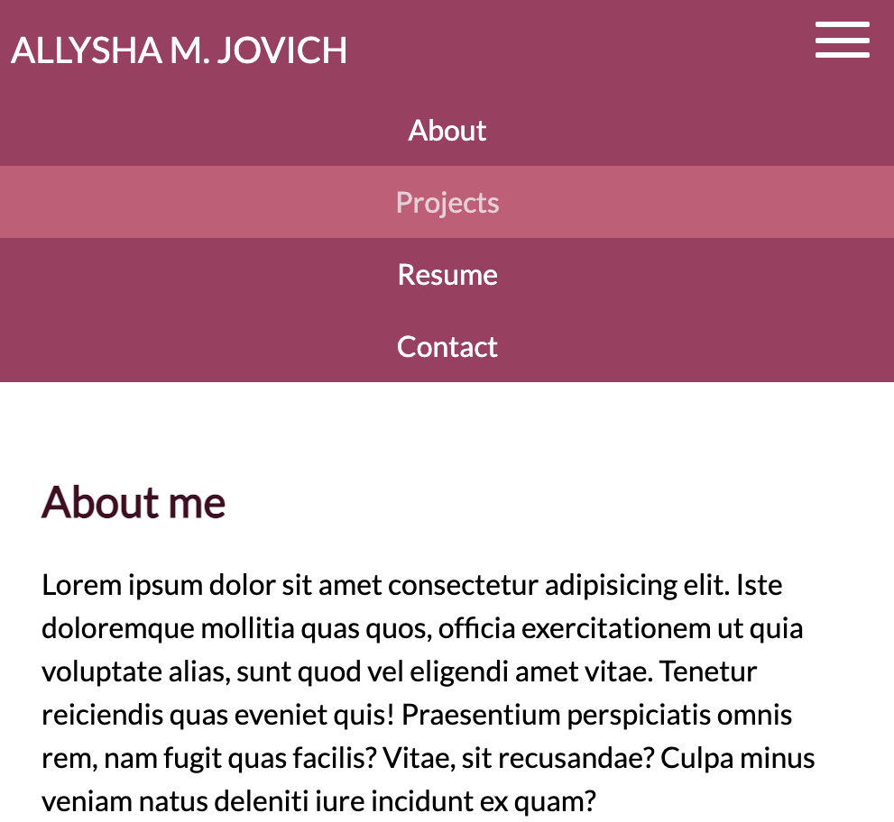
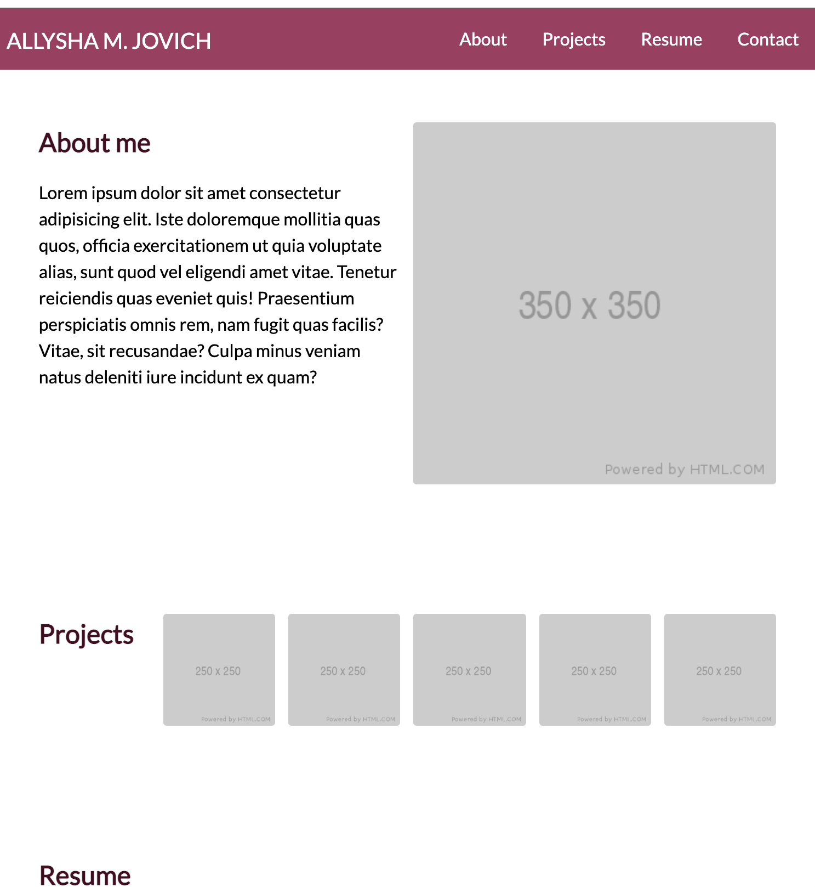
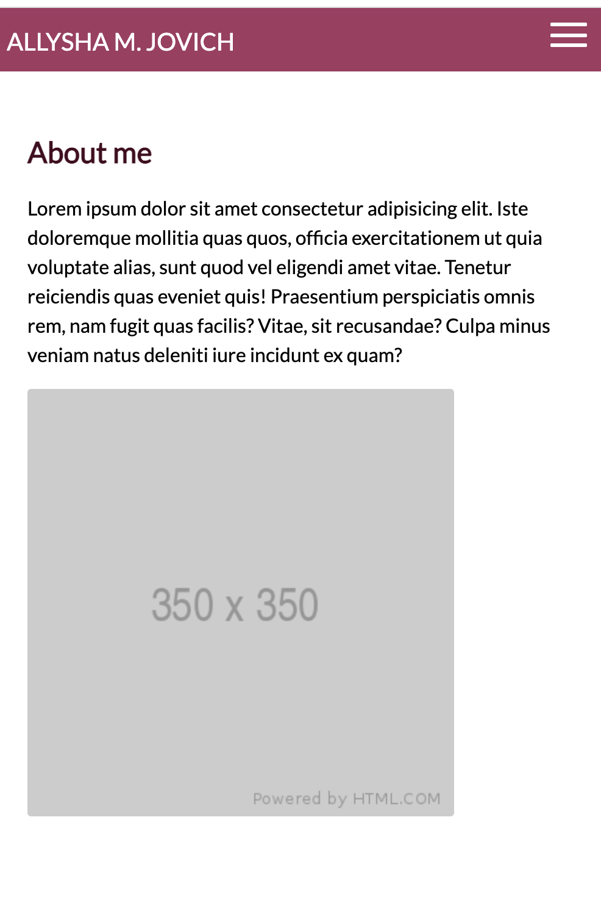

# homework02

## Description

* This is an ongoing project that aims to aid in future employment while demonstrating the technical and creative skills I have gained throughout this bootcamp and in self study. 
 
* I have researched and watched countless YouTube videos related to responsive web design, styling and creating navigation bars, etc. Some of my resouces used are listed below under the header "Resources Used". The list is not exhaustive. 

* There are a lot of notes throughout mainly for myself and what I need to work on in terms of responsive web design, layout, etc. 

* It is by no means a complete project as of 4/19/2021. 

## Goals

* My goals for this project include: 

    * Using appropriate semantic HTML to increase readability and accessibility. 

    * Website is responsive in design for a range of large and small mobile sized screens. 
    
    * Showcase CSS styling skills. 

    * Gain a greater understanding for design, responsiveness and CSS. 

## Resources Used

* YouTube: Web Dev Simplified, Skillthrive, Kevin Powell, Webflow, countless others
* CSS-Tricks A Complete Guide to Flexbox
* W3Schools
* Google Fonts

## Images

## URL of Deployed Application

* 

## URL of GitHub Repository 

* 
